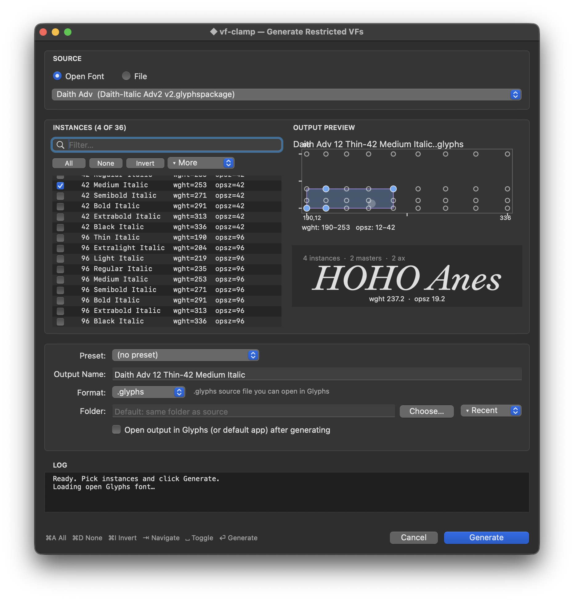

# vf-clamp-glyphs



A [Glyphs.app](https://glyphsapp.com) plugin that generates restricted variable
fonts from any exported TTF/OTF variable font file. Select the named instances
a customer has licensed, click Generate, and receive a micro-VF that spans
exactly that range — with the name table updated to match.

This is the Glyphs.app companion to the
[`@liiift-studio/vf-clamp`](https://vfclamp.com) npm package, which does the
same thing server-side for per-purchase delivery. Both implementations share
the same `compact_name` algorithm; behavioural parity is tracked in
[CHANGELOG.md](CHANGELOG.md) and enforced by the test suite.

---

## Try it live

Want to see what the engine does before installing the plugin? The interactive
web demo at **[vfclamp.com](https://vfclamp.com)** runs the same clamping engine
in your browser — drop in a variable font, pick named instances, and download
the restricted micro-VF. No Glyphs.app required.

---

## Requirements

| Requirement                | Version            |
| -------------------------- | ------------------ |
| Glyphs.app                 | 3.x (3.2+ recommended) |
| Python                     | 3.9+               |
| PyObjC                     | bundled by Glyphs' Python module |
| fontTools                  | >= 4.34.0          |
| vanilla                    | bundled by Glyphs' Python module |
| brotli (only for WOFF2)    | >= 1.0.9 optional  |

The open-Glyphs-font source path (`Open Font` radio) relies on Glyphs 3.2+
APIs (`Glyphs.open(showInterface=False)`, `GSInstance.generate(containers=...)`).
The file-source path works on any Glyphs 3.x build.

> [!IMPORTANT]
> **Install the Python module from Glyphs first** — *Window → Plugin Manager → Modules → Python → Install*. This sets up the Glyphs-managed Python with `PyObjC`, `vanilla`, `fontTools`, and `brotli` all pre-installed. Without it, you'll see *"The Python installation misses the required PyObjC module"* on the first plugin load. Restart Glyphs after installing.

The newer fontTools requirement comes from `instancer.AxisTriple`. Older
versions raise `AttributeError` at startup; the plugin surfaces a clear
message in that case.

---

## Installation

1. Download `vf-clamp-glyphs.zip` from
   [Releases](https://github.com/Liiift-Studio/vf-clamp-glyphs/releases) and
   verify the checksum:
   ```bash
   shasum -a 256 vf-clamp-glyphs.zip
   # compare against vf-clamp-glyphs.zip.sha256
   ```
2. Unzip, then **drag `vf-clamp.glyphsPlugin` onto the Glyphs app icon** (in
   the Dock or in Applications). Glyphs installs it under
   `~/Library/Application Support/Glyphs 3/Plugins/` and offers to restart.

   > Don't double-click the bundle in Finder — because it is unsigned, macOS
   > Gatekeeper blocks it and Glyphs never loads it. Dragging it onto the
   > Glyphs app icon lets Glyphs install it for you and sidesteps Gatekeeper.

3. Restart Glyphs 3 when prompted. The plugin appears under
   **Script › vf-clamp › Generate Restricted VFs…**.

   If you previously tried double-clicking and macOS quarantined the bundle,
   clear the quarantine bit and re-drag it onto the Glyphs icon:
   ```bash
   xattr -dr com.apple.quarantine vf-clamp.glyphsPlugin
   ```

---

## Usage

vf-clamp supports two source modes — pick one with the **Source** radio at
the top of the dialog:

- **Open Font** (default when at least one Glyphs document is open):
  clamps the open `.glyphs` document directly. Can output to a new `.glyphs`
  source file or to a Glyphs-native binary export (TTF/OTF/WOFF/WOFF2)
  routed through `GSInstance.generate`.
- **File**: clamps an already-exported `.ttf`/`.otf`/`.woff`/`.woff2`
  variable font on disk through `fontTools.varLib.instancer`. The original
  workflow.

1. Open Glyphs 3.
2. Go to **Script › vf-clamp › Generate Restricted VFs…**.
3. In the dialog:
   - **Source** — `Open Font` or `File`. The dialog auto-selects the
     frontmost open Glyphs document on launch.
   - **Open Font** popup (Open Font source) — pick which open Glyphs
     document to clamp.
   - **Browse…** (File source) — pick any exported `.ttf`, `.otf`, `.woff`,
     or `.woff2` variable font from disk.
   - **Named Instances** — tick each instance the customer has licensed.
     Use **All / None / Invert** for bulk selection.
   - **Hull** — preview the computed axis hull (e.g. `wght 300–700`).
   - **Output Name** — auto-filled via `compact_name()` (e.g. *Encode Sans
     Light-Bold*); edit freely.
   - **Format** — `.glyphs` (Open Font source only), TTF, OTF, WOFF, or
     WOFF2. WOFF and WOFF2 outputs from the file path are properly
     compressed (not mislabelled sfnt bytes); the open-font path defers to
     Glyphs' own export pipeline.
   - **Output Folder** — defaults to the same folder as the source font
     (file mode) or the open document's filepath (open-font mode), falling
     back to `~/Desktop` if neither is set.
4. Click **Generate**. The spinner and status line update live; the file
   path runs off the main thread so Glyphs stays responsive. The open-font
   path runs on the main thread because the Glyphs APIs require it.
5. Click **Reveal** to surface the saved file in Finder.

If the target file already exists, the plugin appends `-1`, `-2`, ... rather
than silently overwriting.

---

## Screenshot

A screenshot will be added once the next public Glyphs release is captured.

---

## How It Works

### File source — fontTools instancer

For an exported `.ttf`/`.otf`/`.woff`/`.woff2` file the plugin calls
[`fontTools.varLib.instancer`](https://fonttools.readthedocs.io/en/latest/varLib/instancer.html):

1. **`compute_hull`** — finds the bounding box (min/max per axis) across all
   selected named instances. Axes shared by all instances at a single value
   are pinned; axes with variation become a restricted range whose default is
   anchored to a numeric value inside that range.
2. **`instancer.instantiateVariableFont`** — clamps each axis to that range,
   producing a partial instance (still variable) or a pinned static font (if
   only one instance is selected).
3. **`filter_fvar_instances`** — drops named instances the customer did not
   license so the output advertises only the restricted range.
4. **`prune_stat_axis_values`** — removes STAT AxisValue records that fall
   outside the new hull, so OS font menus do not surface unlicensed names.
5. **`patch_name_table`** — updates name IDs 1, 4, 6, 16, 17, 25 across both
   Windows and Mac records (English only; non-English localised records for
   the same IDs are dropped to avoid stale name leakage).
6. **WOFF/WOFF2 flavor** — set on the font before save so the writer produces
   a real WOFF wrapper instead of raw sfnt bytes with a `.woff` extension.

### Open-font source — Glyphs-native pipeline

For an open Glyphs document the plugin operates on the live `GSFont`:

1. **`compute_gsfont_hull`** — finds the per-axis hull from selected
   `GSInstance.axes` coordinates.
2. **`clamp_gsfont`** — copies the font, removes unselected instances,
   removes masters whose coordinates fall outside the hull, drops axes that
   collapse to a single value, and rewrites `familyName`.
3. **`.glyphs` output** — `save_gsfont_to_glyphs` writes the clamped font
   to a new `.glyphs` source file (`makeCopy=True` leaves the user's open
   document untouched).
4. **Binary output (TTF/OTF/WOFF/WOFF2)** — the clamped font is saved to a
   temp `.glyphs`, opened headlessly (`Glyphs.open(showInterface=False)`),
   and exported via `GSInstance.generate(format=…, containers=…)` so Glyphs'
   own compiler produces the final binary.

---

## Output Name Logic

`compact_name(first, last)` strips the shared prefix and suffix of the first
and last selected instance names, then joins the differing parts with a
hyphen:

| Selected                                                  | Output                          |
| --------------------------------------------------------- | ------------------------------- |
| Light only                                                | Light                           |
| Light + Bold                                              | Light-Bold                      |
| Encode Sans Light + Encode Sans Bold                      | Encode Sans Light-Bold          |
| Encode Sans Condensed Light + Encode Sans Condensed Bold  | Encode Sans Condensed Light-Bold|

---

## Development

```bash
# Install dev dependencies
pip install -r requirements-dev.txt

# Run the test suite
pytest

# Rebuild the distributable zip
./scripts/build-zip.sh
```

`core.py` holds the fontTools helpers (file-source path) and, under an
optional `from GlyphsApp import ...` guard, the GSFont helpers used by the
open-Glyphs-font source path. The fontTools subset is framework-agnostic and
importable in CI; the GSFont subset only resolves inside Glyphs.app. The
AppKit/PyObjC dialog shell lives in `plugin.py`. Tests live in `tests/` and
use `fontTools.fontBuilder` to construct an in-memory variable font fixture
(no external font files needed); the GSFont helpers are exercised inside
Glyphs.app and are not covered by CI.

---

## Troubleshooting

**The plugin does not appear under Script › vf-clamp**

- Confirm the plugin is in `~/Library/Application Support/Glyphs 3/Plugins/`
  (not `Glyphs 2/`).
- Restart Glyphs after installing.
- Check **Window › Macro Panel** for Python errors printed at startup.

**"fontTools is not available" / AttributeError on AxisTriple**

`AxisTriple` requires fontTools >= 4.34. fontTools is bundled with Glyphs 3
but older Glyphs builds may carry an older fontTools. Upgrade Glyphs, or
install a newer fontTools into the Python environment Glyphs uses.

**"This font has no variable axes"**

The selected file is a static font, not a variable font. Export a variable
font from your Glyphs source first (`File › Export…`, choose the Variable
Font exporter).

**"WOFF2 output requires the brotli package"**

WOFF2 compression requires the optional `brotli` package. Install it into the
Python environment used by Glyphs, or pick TTF / OTF / WOFF instead.

**Output font looks wrong / instancer raises an error**

Check the Macro Panel for a full traceback. The most common cause is selecting
instances whose axis coordinates push the instancer outside the fvar default
range.

**No named instances appear in the list**

The font's `fvar` table has no named instances, or all instance name IDs are
missing from the `name` table. This can happen with fonts exported from
certain tools. Check your export settings.

**"No Glyphs fonts are currently open"**

You selected `Open Font` as the source but no Glyphs documents are open in
the foreground. Open the document you want to clamp, or switch to the
`File` source and Browse to an exported variable font.

**"That Glyphs font has no exportable named instances"**

The selected Glyphs document either has no `GSInstance` entries, or every
instance is a Variable Font Setting (which is skipped — it describes how to
export a VF, not a static named instance).

**"No masters fall within the hull of the selected instances"**

vf-clamp cannot reconstruct the design space from instances alone — it
prunes masters that fall outside the hull of selected instances. Pick at
least two instances whose coordinates span existing masters.

**"`.glyphs` output requires using an open Glyphs font as the source"**

The `.glyphs` output format is only available when the source is an open
Glyphs document. Switch the Source radio to `Open Font` (or pick TTF/OTF/
WOFF/WOFF2 to use the file source).

---

## Related

- **[vf-clamp npm package](https://vfclamp.com)** — server-side per-purchase
  restricted VF delivery.
- **[@liiift-studio/vf-clamp on npm](https://www.npmjs.com/package/@liiift-studio/vf-clamp)** —
  Vercel function + Sanity integration.

---

## License

MIT — see [LICENSE](LICENSE) — © Liiift Studio
